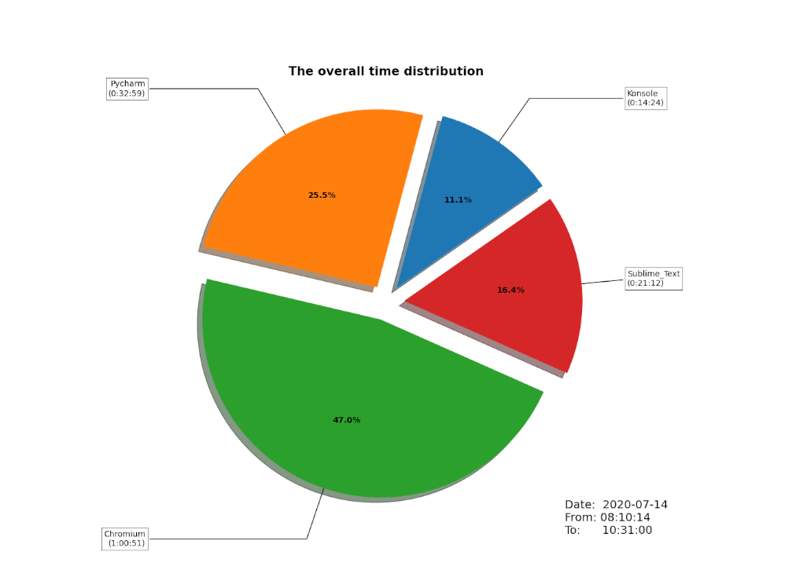
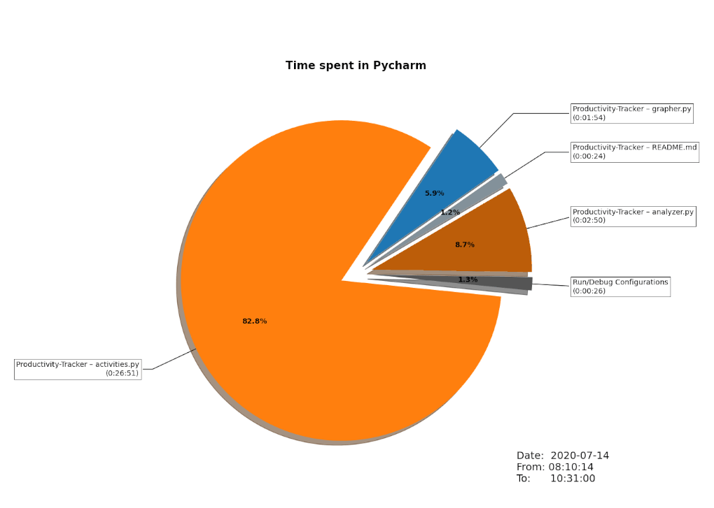

# Productivity-Tracker
This is a simple productivity tracker that logs user activity and analyzes it at the end of the day.

The overall time distribution

Time spent in Pycharm

## Future work
* Timeline of the day
* More chart types
* Inactivity detection (tracker)
* Install script
* Automated plot generation at the end of the day
* Long time tracking 
* Deleting logs after they have been analyzed
* and more 

## WARNING
* __This tracker is intended to be used for tracking ONLY your activity for statistical purposes. Using it to track someone else's activity without their approval is prohibited, unethical and illegal!__

* __Make sure you protect your logs and don't share them with anyone.__